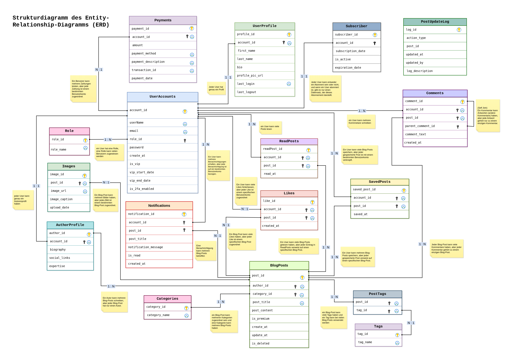
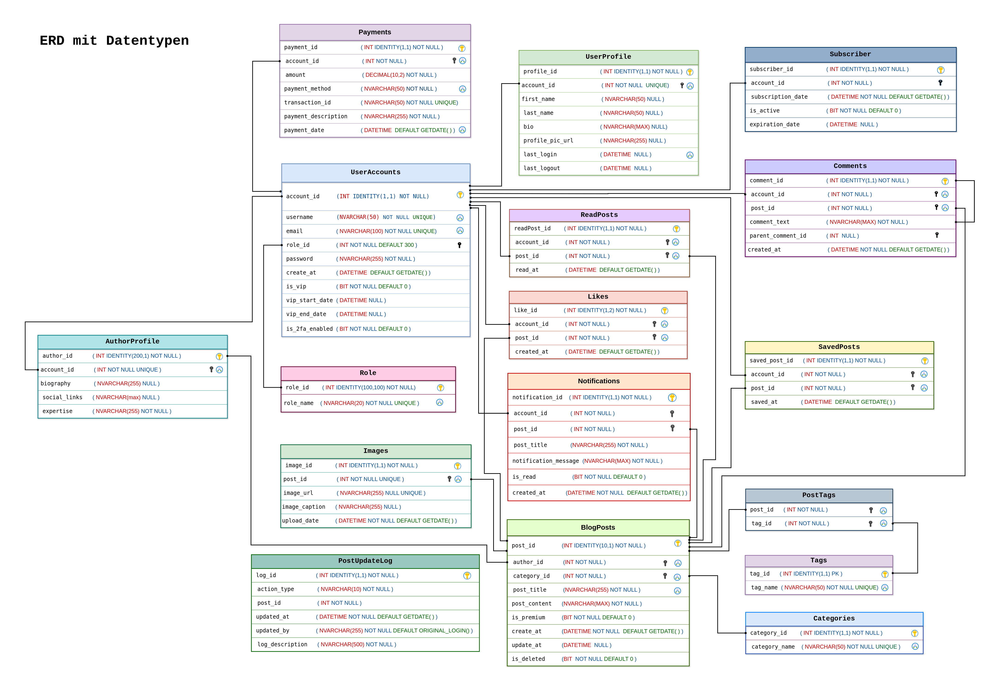
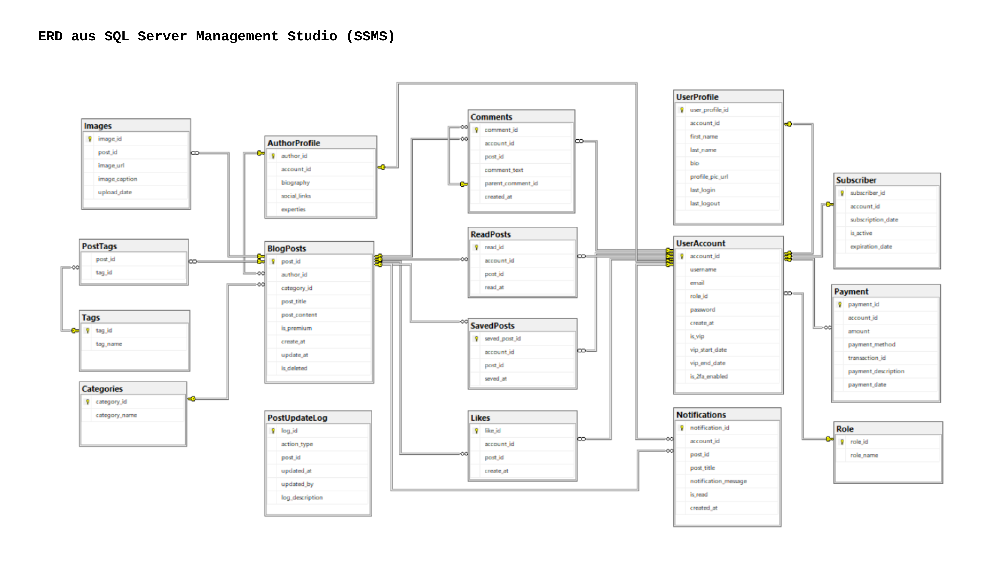
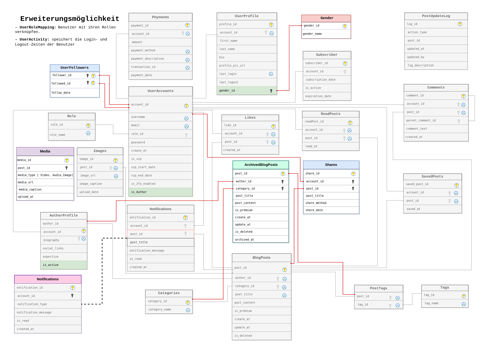

# BlogPlatformDB

## Project Overview
**BlogPlatformDB** is a SQL-based database designed for a blogging platform. This database supports various features such as managing blog posts, users, comments, categories, tags, and payment-related information. It also includes stored procedures, functions, and triggers to enforce business logic and ensure data integrity.

## Features
- **Blog Post Management**             : Stores and organizes blog posts, including title, content, category, creation, and update timestamps.
- **User and Role Management**         : Users can register, create profiles, and be assigned roles such as User or VIP.
- **Comments and Likes**               : Users can comment on and like blog posts, fostering interaction.
- **Stored Procedures and Functions**  : Complex business logic like upgrading a user to VIP, adding comments, and generating notifications is handled through stored procedures and functions.
- **Triggers**                         : Logs changes to blog posts and manages soft deletes.

## Database Schema
The database consists of 17 tables that form the core functionality of the blogging platform. Below is a visual representation of the database schema:





### Key Tables
- **UserAccount**  : Stores essential user data for authentication and role assignment.
- **UserProfile**  : Contains optional profile data like first name, last name, biography, and profile picture.
- **BlogPosts**    : Holds the blog content created by authors.
- **Comments**     : Stores comments on blog posts.
- **Likes**        : Tracks the likes each blog post receives.
- **Payment**      : Stores payment information for users upgrading to VIP status.
- **PostUpdateLog**: Logs changes to blog posts for historical tracking.

## Installation and Usage
1. **Clone the Repository**:
   ```bash
   git clone https://github.com/mahboube89/BlogPlatformDB.git
2. **Import SQL Scripts**:
  - Open SQL Server Management Studio (SSMS).
  - Import the SQL scripts from the SqlScripts/ folder into your database instance.
  - Ensure that all tables, procedures, functions, and triggers are correctly created.


## SQL Scripts
The repository includes SQL scripts for all database objects, including tables, views, stored procedures, functions, and triggers. These scripts are located in the sql/ folder.

## Functions and Procedures
   ### Scalar Functions
   - **SF_Get_Like_Count_By_Post**    : Returns the number of likes for a specific blog post. Useful for assessing the popularity of a post.
   - **SF_Get_Post_Count_By_Category**: Returns the number of blog posts in a specific category.
   ### Table-Valued Functions
   - **TF_Get_Most_Like_Post_By_Category**: Returns the blog post with the most likes in a specific category. This function helps identify the most successful posts within a category.
   - **TF_Get_Posts_By_Author**: Returns a table with all blog posts by a specific author.
   - **TF_Get_Tags_By_Post**   : Returns all tags associated with a specific blog post.
### Stored Procedures
  - **SP_Add_Comment**        : Allows a user to add a comment to a blog post after verifying that the user has read the post. It also ensures that the comment text is not empty and does not exceed the maximum length.
  - **SP_Upgrade_User_To_VIP**: Upgrades a user's account to VIP status after a successful payment. It updates the user's VIP details and logs the payment in the database.
  - **SP_Create_Post_Notifications**: Generates notifications for users when a new blog post is created. This is used to inform subscribers about new content.
### Triggers
  - **TR_BlogPosts_Delete_Log**: This trigger performs a soft delete of a blog post by setting the is_deleted flag to 1 instead of removing it from the database entirely. It also logs the deletion in the PostUpdateLog table, capturing who deleted the post and when.
  - **TR_BlogPosts_Insert_Log**: Logs the creation of a new blog post in the PostUpdateLog table.
  - **TR_BlogPosts_Update_Log**: Logs updates to blog posts, including changes to post_title, post_content, is_premium, and category_id. It also updates the update_at timestamp in the BlogPosts table.

## Future Enhancements
There are several potential extensions for this project that could add new features and flexibility:

- **Archiving Old Blog Posts**: Implement a system to archive old blog posts, moving them from the main table to an archive table.
- **User Follow System**      : Allow users to follow each other and receive notifications about their activities.
- **Media Management**        : Extend support for images and videos in blog posts, perhaps integrating with a media management system.
- **Sharing Blog Posts**      : Enable users to share blog posts on other platforms or with other users.
- **Gender Information**      : Add a Gender table to store gender-specific information for user profiles.

## License
This project is licensed under the MIT License.

## Contact
For any questions or suggestions, please contact mahboube89r@gmail.com.
